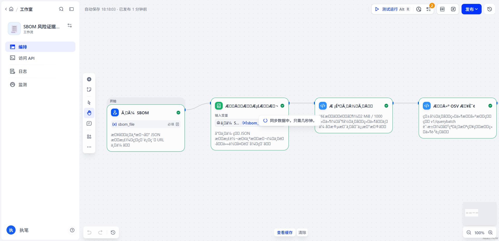
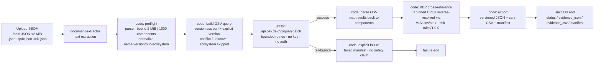

# SBOM Risk Evidence Assistant

**Deterministic SBOM risk evidence, built inside Dify as a native Workflow app** — upload a CycloneDX / SPDX SBOM, get schema-preflighted, OSV-verified, CISA KEV cross-referenced evidence cards plus JSON / CSV audit exports with a reproducible run manifest. No LLM, no new containers, no host dependency.


-3776AB)


> SBOM 上传 → 结构预检（CycloneDX 1.6 / SPDX 2.3）→ 有界 OSV `v1/querybatch` 核验 → CISA KEV 交叉引用（pinned 3-CVE 子集，SHA-256 钉死）→ 风险证据卡（`known_exploited` / `vulnerable_evidence_incomplete` / `no_match` / `unknown`）→ 版本化 JSON + 表格安全 CSV + 可复现运行清单。全部确定性逻辑运行在 Dify 沙箱 code 节点内；**"no match" 永不表述为 "safe"**，未知原因、KEV 快照日期与数据截止时间始终可见。

<details>
<summary>📑 Table of Contents</summary>

- [Latest Updates](#latest-updates)
- [Workflow Preview](#workflow-preview)
- [Why this exists](#why-this-exists)
- [Architecture](#architecture)
- [Core capability matrix](#core-capability-matrix)
- [Quick Start](#quick-start)
- [Evaluation & Regression](#evaluation--regression)
- [Safety Boundary](#safety-boundary)
- [Project Structure](#project-structure)
- [Deployment Notes](#deployment-notes)
- [Data Sources & Licensing](#data-sources--licensing)
- [FAQ](#faq)

</details>

---

## Latest Updates

- **2026-08-12** Offline regression suite + GitHub Actions CI shipped: 99/99 checks green — fixture gold matrix (9 cases), export schema validation (6 shapes), KEV SHA-256 pin chain, DSL byte-determinism gate, graph integrity (11 nodes / 10 edges, all selectors resolve). See [Evaluation & Regression](#evaluation--regression).
- **2026-08-12** Fixed: SPDX 2.3 package versions were silently dropped — preflight read `version` only, never `versionInfo`, so SPDX inputs degraded to versionless OSV queries. `versionInfo` is now read; regression locked the fix.
- **2026-08-12** Fixed: `evidence-export/1.0.0` schema did not match the actual export contract (wrong field names, `additionalProperties: false` rejected real exports). Schema rewritten to the contract and enforced by the suite.
- **2026-08-12** Fixed: `data/kev/manifest.json` referenced deleted schema archives; KEV subset title cleaned; LICENSE completed to the full Apache-2.0 text.

## Workflow Preview



The editor view of the imported app (evidence capture under `artifacts/dify/`).

## Why this exists

SBOMs tell you *what* is in your software; they do not tell you *whether it is under attack*. This workflow turns an SBOM into a reproducible risk-evidence document:

- **Cross-checks** every component against the official public OSV API.
- **Reverse-resolves** a pinned CISA KEV subset through OSV detail lookups, so OSV vulnerability IDs are matched to exploited-in-the-wild CVEs by alias, not by string guessing.
- **Never overclaims**: `no_match` means "no vulnerability recorded at query time", `unknown` means "not queryable", and every card carries the KEV snapshot date, data-cutoff context, rule version and a disclaimer.

The entire tool is a Dify Workflow app — the deterministic rules are sandboxed Python code nodes, and the workflow graph itself is the executable surface. It was designed so an auditor can read the rules (they are plain code in this repository), re-generate the graph byte-for-byte, and reproduce every conclusion offline.

## Architecture

The workflow runs **inside the existing Dify runtime containers** (api / worker / sandbox / ssrf-proxy). No companion service, no new container, no host dependency. One standard deployment change is required: allow `api.osv.dev` through Dify's SSRF proxy ACL (see [Deployment Notes](#deployment-notes)).



All deterministic logic is sandboxed Python (stdlib only; `requests` is used solely for the bounded 3-CVE KEV reverse resolution). Uploaded fields are untrusted data: they never control a URL, are never executed, and are never logged raw. CSV output neutralizes `=`, `+`, `-`, `@` prefixes; HTML/prompt-like fields stay data-only in exports.

The complete specification — acceptance contract, failure contract, evidence levels — is in [`docs/SPEC.md`](docs/SPEC.md).

## Core capability matrix

| Stage | What happens | Deterministic output |
|-------|--------------|----------------------|
| Upload | Exactly one local JSON document (`.json` / `.spdx.json` / `.cdx.json`, ≤ 2 MiB); remote URL upload disabled | start-node file variable |
| Preflight | Parse & bound (2 MiB / 1,000 components); normalize name, version, ecosystem, PURL; version conflicts and unknown ecosystems are flagged, never guessed | `SBOM_INVALID` / `SBOM_UNSUPPORTED` / `INPUT_TOO_LARGE` / `TOO_MANY_COMPONENTS`, or normalized components |
| OSV query | Bounded `v1/querybatch` request (versionless PURL + explicit version, per OSV contract) with retries; fail-branch produces an explicit failure card | `querybatch` payload, queryable count, skipped components |
| KEV cross-reference | The 3 pinned KEV CVEs are reverse-resolved via OSV `v1/vulns/{id}` (exactly 3 lookups); resolution failures can only **downgrade** a conclusion | ID→CVE mapping, then `risk-rules/1.0.0` states |
| Risk evidence card | Per component: state, reason, query time, KEV snapshot + SHA-256, rule version, sources, vulnerability IDs, disclaimer | JSON evidence (`evidence-export/1.0.0`) |
| Export | Versioned JSON + spreadsheet-safe CSV + reproducible run manifest (`run-manifest/1.0.0`) | Explicit workflow outputs |

**Risk states** (`risk-rules/1.0.0`):

| State | Meaning |
|-------|---------|
| `known_exploited` | OSV vulnerability ID matches a KEV-resolved ID (pinned snapshot) |
| `vulnerable_evidence_incomplete` | OSV reports vulnerabilities but no verified KEV match in the pinned snapshot |
| `no_match` | Completed OSV query returned no vulnerability — **not proof of safety** |
| `unknown` | Not queryable (version conflict / unknown ecosystem / source failure) |

**Run states**: `completed` / `partial` (some components unresolved) / `failed` (invalid input or OSV unavailable — no claims emitted).

## Quick Start

### Option A — import into your own Dify (recommended)

Prerequisites: a Dify deployment (tested on 1.16.1) where you can log in to the console.

1. Allow the OSV API through Dify's SSRF proxy (one line in `docker/ssrf_proxy/squid.conf.template`):
   ```
   acl allowed_domains dstdomain .marketplace.dify.ai api.osv.dev
   ```
   then restart the `ssrf_proxy` container. Required for Dify HTTP nodes to reach `api.osv.dev`; the code-node KEV resolution uses the same proxy.

2. Import `dify/sbom-risk-evidence-workflow-native.yml` (Studio → Create app → Import DSL), then publish.

3. Run an SBOM: open the app, upload `fixtures/sbom/cyclonedx-valid.json`, inspect the trace, download the JSON / CSV exports.

### Option B — local tooling

```bash
# Re-generate the DSL + graph JSON from the embedded rules (byte-deterministic)
python3 -m pip install -r tools/requirements.txt
python3 tools/build_native_graph.py

# Run the offline regression suite (no network)
python3 tools/regression_suite.py
```

`tools/cdp.js`, `tools/deploy_draft.js` and `tools/run_workflow.js` are browser-session automation helpers (Chrome DevTools Protocol) used to build and exercise the app in a logged-in browser:

```bash
node tools/deploy_draft.js <page-ws-url> dify/graph-native.json <app-id>   # deploy + publish
node tools/run_workflow.js <page-ws-url> fixtures/sbom/cyclonedx-live-smoke.json   # run and print result
```

## Evaluation & Regression

The deterministic core is exercised by `tools/regression_suite.py` — an **offline** suite (no network) that extracts the exact code-node snippets embedded in the workflow, executes them against the committed fixtures with a canned OSV `v1/querybatch` transcript, and asserts the full contract. It runs locally and as a CI gate on every push to `main`.

**Result (2026-08-12, Python 3.12, CI + local identical): 99/99 checks passed.**

Fixture gold matrix (actual states produced by the suite):

| Fixture | Run state | Per-component states |
|---------|-----------|----------------------|
| `cyclonedx-valid.json` | `completed` | `known_exploited` (log4j-core → GHSA-jfh8-c2jp-5v3q = CVE-2021-44228) · `vulnerable_evidence_incomplete` (django) · `no_match` (left-pad) |
| `cyclonedx-live-smoke.json` | `completed` | `known_exploited` |
| `spdx-valid.json` | `completed` | `vulnerable_evidence_incomplete` (lodash → CVE-2021-23337) · `no_match` |
| `nested-components.json` | `completed` | `no_match` × 2 (nested components flattened) |
| `unknown-ecosystem.json` | `partial` | `unknown` (pkg:generic not queryable) |
| `version-conflict.json` | `partial` | `unknown` (purl 1.3.0 ≠ declared 2.0.0) |
| `missing-required-field.json` | `failed` | — (`SBOM_INVALID`, no claims) |
| `malicious-fields.json` | `completed` | `no_match`; no raw field echo; no formula-prefixed CSV cell |
| oversize (generated ≥ 2 MiB) | `failed` | — (`INPUT_TOO_LARGE`, no claims) |

Structural gates (all enforced by the suite): evidence exports validate against `schemas/output/evidence-export-1.0.0.schema.json` (success, failed-run and HTTP fail-branch shapes); KEV subset SHA-256 chain — data file ≡ `data/kev/manifest.json` ≡ embedded constant; KEV reverse resolution bounded to exactly 3 lookups; DSL regeneration is byte-identical to the committed `dify/` files; graph integrity — unique node ids, 11 nodes / 10 edges, every variable selector resolves, fail-branch wired.

**Honest boundaries**

- The suite's OSV transcript is a **canned, structurally faithful** stand-in (`fixtures`-driven), not a live API capture; CI never calls `api.osv.dev`. Live OSV interoperability and the end-to-end Dify run were verified against a real deployment (see `docs/SPEC.md`, evidence levels); that verification is recorded, not continuously re-executed in CI.
- The suite feeds `preflight` the extracted document text directly; the `document-extractor` step itself is Dify runtime behavior and is not re-run offline.
- `no_match` is a point-in-time statement. KEV snapshot (`2026-08-10T16:19:34.1767Z`, SHA-256 pinned) and per-source data cutoff are always visible on the cards.
- `vulnerable_evidence_incomplete` is deliberately *not* "vulnerable": a missing KEV mapping may reflect the pinned subset, not reality.

## Safety Boundary

- Inputs are data, never instructions: no arbitrary-URL ingestion, no secrets, no front-end credentials.
- KEV integrity is pinned by SHA-256; resolution failures can only downgrade a conclusion (`vulnerable_evidence_incomplete`), never fabricate one.
- HTTP failures produce an explicit `failed` manifest with no safety claim; uploaded content is never reflected into exports.
- The workflow never executes uploaded fields, and CSV output is spreadsheet-safe (formula prefixes neutralized).

## Project Structure

```
dify-sbom-risk-evidence/
├── dify/                        # the executable surface
│   ├── sbom-risk-evidence-workflow-native.yml   # importable Dify DSL
│   └── graph-native.json        # regenerated graph (byte-deterministic)
├── tools/
│   ├── build_native_graph.py    # embedded rule source + DSL/graph generator
│   ├── regression_suite.py      # offline regression suite (99 checks)
│   ├── requirements.txt
│   ├── cdp.js                   # minimal CDP client
│   ├── deploy_draft.js          # deploy graph to Dify draft + publish
│   └── run_workflow.js          # run a fixture through the console API
├── fixtures/sbom/               # valid + abnormal + malicious input fixtures
├── data/kev/                    # pinned CISA KEV subset + provenance manifest
├── schemas/output/              # evidence-export contract (JSON Schema)
├── third_party/licenses/        # pinned license texts of third-party data
├── artifacts/dify/              # live-app editor screenshots (evidence)
├── docs/SPEC.md                 # canonical specification
├── .github/workflows/ci.yml     # regression + determinism + lint gates
└── LICENSE                      # Apache-2.0
```

## Deployment Notes

- **Dify version**: tested on 1.16.1 (api / worker / sandbox / ssrf-proxy). Importing the DSL requires a console login; the app name is unique (`SBOM Risk Evidence 20260811 019fef`) and does not touch existing apps, bind mounts, or credentials.
- **SSRF proxy**: `api.osv.dev` must be allowed in `docker/ssrf_proxy/squid.conf.template` (see [Quick Start](#quick-start)); this is the single documented deployment-level change.
- **No secrets**: the OSV API is public and keyless; the workflow carries no credential variables.
- **CI**: `.github/workflows/ci.yml` runs the offline regression suite, the DSL determinism gate, pyflakes-subset lint, and Node syntax checks for the automation helpers. No network access to OSV/KEV is used in CI.

## Data Sources & Licensing

- **OSV API**: official public API, no key required. `v1/querybatch` returns compact summaries; the workflow resolves the three pinned KEV CVEs via `v1/vulns/{id}` for alias-based matching.
- **CISA KEV**: CC0-1.0, pinned to commit `b82bd290510b1f553dafc6a0d996e6c38305bc66` (subset SHA-256 `89689b4485bf16702a36dde7c901766d56521720f79275425e07a77763e26c73`, snapshot `2026-08-10T16:19:34.1767Z`; full provenance in `data/kev/manifest.json`).
- **Formats**: CycloneDX 1.6 / SPDX 2.3 JSON. The output contract is JSON Schema `schemas/output/evidence-export-1.0.0.schema.json`; license texts of third-party data are archived under `third_party/licenses/`.

## FAQ

<details>
<summary><b>Do I need an LLM or a model API key?</b></summary>

No. Every conclusion is produced by deterministic sandboxed code nodes; there is no LLM dependency, no prompt, and no model credential anywhere in the workflow.
</details>

<details>
<summary><b>Is "no match" the same as "safe"?</b></summary>

No, and the workflow never says so. `no_match` means the OSV query returned no vulnerability at query time — it is a point-in-time statement, and each card carries the KEV snapshot date and a disclaimer making that explicit.
</details>

<details>
<summary><b>Does the workflow need internet access?</b></summary>

Yes for live OSV/KEV resolution (`api.osv.dev` through Dify's SSRF proxy). Everything else — parsing, normalization, bounding, exports — runs offline. The regression suite is fully offline.
</details>

<details>
<summary><b>Can I audit what the workflow actually does?</b></summary>

Yes. The exact code executed in every code node is plain source in `tools/build_native_graph.py`; the DSL and graph are re-generated byte-identically, and the offline suite proves the committed artifacts match the rules. See [`docs/SPEC.md`](docs/SPEC.md) for the acceptance and failure contracts.
</details>

<details>
<summary><b>Which SBOM formats are supported?</b></summary>

CycloneDX 1.6 JSON and SPDX 2.3 JSON (including purl via `externalRefs`). XML, SPDX tag/value, remote URLs, archives, and VEX interpretation are out of scope for version 0.1.0.
</details>

<details>
<summary><b>What happens if the OSV API is down or a component is unresolvable?</b></summary>

Bounded retries first; if they are exhausted the fail-branch emits an explicit `failed` manifest with no safety claim. Components with version conflicts or unknown ecosystems are marked `unknown` (run state `partial`) — never guessed.
</details>

## License

Apache-2.0 — see `LICENSE`. Pinned third-party data retains its own licenses (CC0-1.0 for CISA KEV, Apache-2.0 for the CycloneDX spec, CC-BY-3.0 for SPDX).
